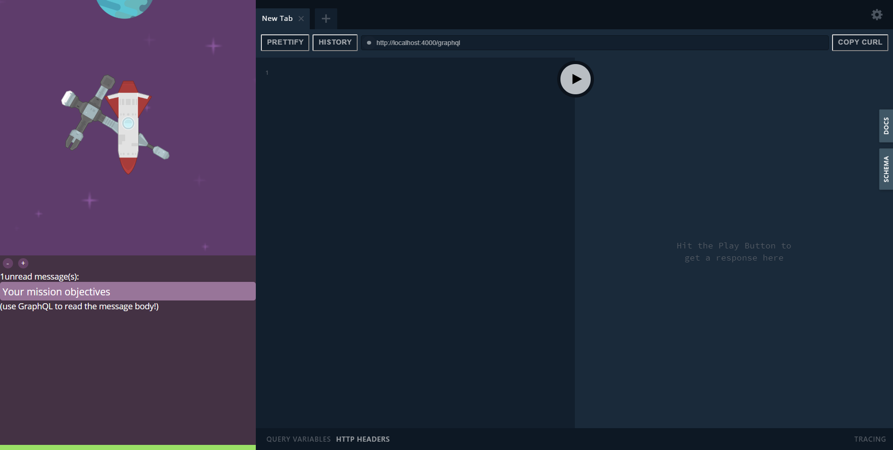

# Welcome to the future!

The year is 2051, 13 years after the catastrophy which nearly brought the human race to extinction. The Earth has cooled off significantly, and it is no longer safe to inhabit. The United Federation of Nations spent the last 10 years constructing a starship, capable of crossing the voids of interstellar space.

Unfortunately, there was not enough time to finish the starship completely. Instead of a proper bridge with proper controls to pilot the vessel, the architects decided to simply expose a [GraphQL](https://graphql.org/) API, and let potential pilots pilot it that way.

But that must be enough, because *YOU* must pilot the vessel. Take command of the starship, learn GraphQL, and save the human race from utter extinction!



## Technologies used

The following technologies are used in this project:

### Backend

* [TypeScript](https://www.typescriptlang.org/)
* [TypeGraphQL](https://typegraphql.ml/)
* [class-transformer](https://github.com/typestack/class-transformer)
* [graphql-query-complexity](https://github.com/slicknode/graphql-query-complexity)

### Frontend

* [TypeScript](https://www.typescriptlang.org/)
* [React](https://reactjs.org/)
* [GraphQL Playground](https://github.com/prisma-labs/graphql-playground)
* [Apollo Client](https://www.apollographql.com/docs/react/)

## Running the project locally

There are a few ways of running the project locally:

### Via docker (recommended)

Run the following two commands in separate terminal sessions:

```bash
docker run -p 4000:4000 -it --rm jorisd/welcome-to-the-future-backend
```

```bash
docker run -p 4001:80 -it --rm jorisd/welcome-to-the-future-frontend
```

Then visit http://localhost:4001 to get started saving the human race!

### Via docker-compose

First, clone this repository, then:

```
docker-compose up
```

Next, visit http://localhost:4001 to get started!

### Locally, without docker

Alternatively, you can clone this repository and then run the backend and frontend separately:

```
cd backend
npm i
npm run dev
```

```
cd frontend
yarn
yarn dev
```

Then visit http://localhost:1234 and get started saving the human race!

## Acknowledgements

This project uses public domain assets from [Kenney](https://www.kenney.nl/assets), [kingcreator11](https://opengameart.org/content/planetary-platformer-pack) and [salemf](https://opengameart.org/content/shiny-sun). Furthermore, the universe data inside of the game is adapted from [Star Control II](http://sc2.sourceforge.net/).

All other code or assets are licensed under the MIT license.
